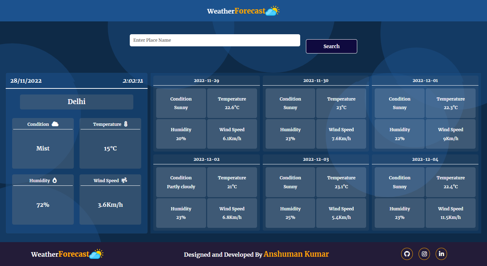

# Project - Weather And WeatherForeCast Web-Application

This is a Weather and Weather forecast web application, which made with HTML, CSS , JavaScript and Weather API .

This Website shows the current weather information and next 6 days weather information of the country you search.

By default the location set to "India".

You can search your Country by enter the name of your country in the searach box and than click on the Search button.

If your country found, it's shows the weather details, but if it not then the previous location weather details will continue to show in the screen.

You always try to give the correct and valid name of country otherwise it shows an error message.

